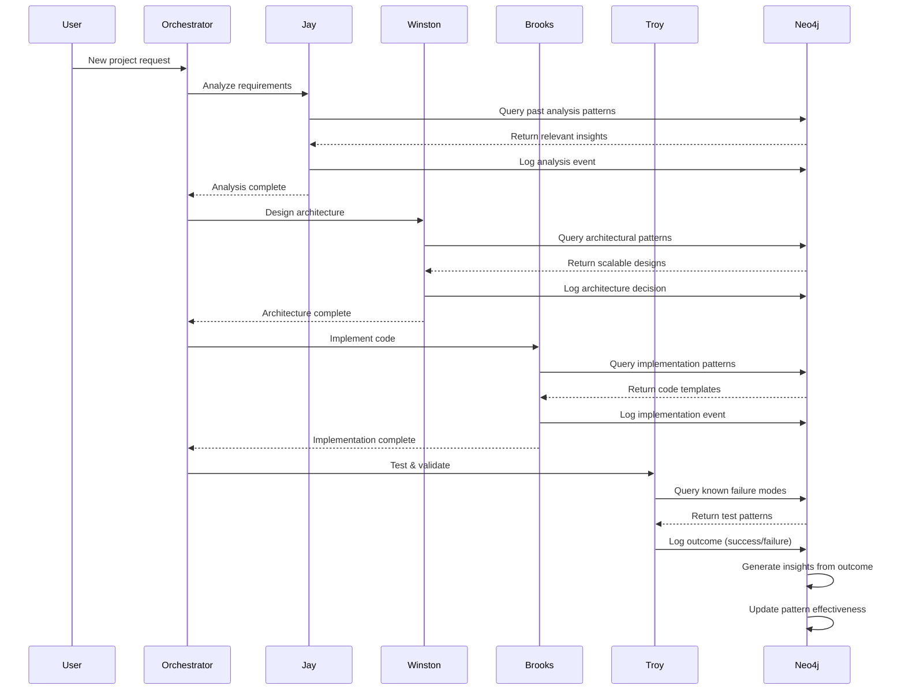

# Product Requirements Document: BMAD Agent Memory Integration

**Document Type:** Product Requirements Document (PRD)  
**Version:** 1.0  
**Created By:** Winston (Architect)  
**Date:** January 25, 2026  
**Project Group:** `global-coding-skills`  
**Status:** Approved for Implementation  
**Repository:** [neoronin](https://github.com/Charitablebusinessronin/neoronin)

---

## Executive Summary

Integrate the BMAD agent roster (Jay, Winston, Brooks, Dutch, Troy, Bob, Allura, Master, Orchestrator) into the Grap Neo4j infrastructure to create a self-improving, persistent agent memory system that learns from every coding task across three project groups: `faith-meats`, `diff-driven-saas`, and `global-coding-skills`.

This integration transforms BMAD from stateless agents into continuously learning entities that remember past solutions, avoid repeated failures, and share knowledge across the team—creating a compounding advantage over time.

---

## Problem Statement

BMAD agents currently operate without persistent memory, pattern recognition, or cross-agent knowledge transfer. Each session starts from zero, unable to leverage:

- **Past Solutions**: Brooks reimplements authentication systems that Winston already designed
- **Failed Approaches**: Troy tests the same broken patterns that failed in previous sprints
- **Successful Architectural Patterns**: Winston's scalable designs aren't reused by other projects
- **Cross-Agent Learning**: Jay's analysis insights don't inform Dutch's PRD creation

This creates redundant work, repeated mistakes, and limits autonomous improvement—the core promise of AI-driven development.

---

## Success Metrics

| Metric | Target | Measurement Method | Review Frequency |
|--------|--------|-------------------|------------------|
| **Pattern Reuse Rate** | >60% of tasks leverage existing patterns | Query `Pattern.times_used` | Weekly |
| **Agent Learning Velocity** | 15+ new high-confidence insights per week per active project | Count `Insight` nodes with `confidence_score > 0.7` | Weekly |
| **Cross-Agent Knowledge Transfer** | 5+ insights shared between agents monthly | Track `(:Agent)-[:CAN_APPLY]->(:Insight)` relationships | Monthly |
| **System Uptime** | 99.5% availability for graph queries | Neo4j health checks via existing monitoring | Daily |
| **Insight Accuracy** | >85% of applied insights result in successful outcomes | Compare `Insight.success_rate` | Monthly |

---

## Solution Architecture

### Integration with Grap Infrastructure

The BMAD schema extends the current Neo4j setup without disrupting existing backup, health monitoring, or Docker architecture:

1. **Schema Layer**: Deploy BMAD nodes and relationships as additive Cypher scripts executed via `scripts/schema/` directory
2. **Backup Coverage**: APOC `graphml.all` exports automatically include BMAD nodes in existing scheduled backups (2 AM daily)
3. **Health Monitoring**: Extend existing orphaned relationship detection to validate agent workflow integrity
4. **Access Pattern**: Agents query via Neo4j Bolt driver using existing `NEO4J_URI` connection string

### Data Isolation Strategy

Multi-tenant architecture using `group_id` property across all nodes to support parallel agent workflows:

- **`faith-meats`**: Faith Meats project-specific learning and context
- **`diff-driven-saas`**: Diff-Driven SaaS project-specific patterns
- **`global-coding-skills`**: Cross-project universal patterns and BMAD workflow templates

This allows agents to:
- Query project-specific context for focused learning
- Promote successful local patterns to global knowledge
- Prevent context bleeding between unrelated projects

### Brain Scoping Model

Three-tier knowledge hierarchy enables granular memory access:

#### 1. Agent-Specific Brains
```cypher
(:Brain {name: 'Troy Brain', scope: 'agent_specific', group_id: 'global-coding-skills'})
```
- Troy's testing patterns and quality checklists
- Brooks's preferred code refactoring techniques
- Winston's architectural decision templates

#### 2. Project-Specific Brains
```cypher
(:Brain {name: 'Faith Meats Brain', scope: 'project_specific', group_id: 'faith-meats'})
```
- Faith Meats domain knowledge (meat processing, compliance, inventory)
- Faith Meats technical stack decisions (Payload CMS, Vercel, Neo4j)
- Faith Meats user personas and UX patterns

#### 3. Global Brain
```cypher
(:Brain {name: 'BMAD Global Brain', scope: 'global', group_id: 'global-coding-skills'})
```
- Universal coding patterns (OAuth2 implementation, REST vs GraphQL)
- BMAD workflow templates (Planning → Development → Testing)
- Cross-project architectural insights (microservices vs monolith trade-offs)

---

## Core Schema Components

### Agent Layer

**Node: `(:AIAgent)`**
```cypher
(:AIAgent {
  name: String,              // 'Jay', 'Winston', 'Brooks', etc.
  role: String,              // 'Analyst', 'Architect', 'Developer', etc.
  file_reference: String,    // 'analyst.md', 'architect.md'
  capabilities: [String],    // ['code_review', 'architecture_design']
  integration_points: [String], // ['GitHub', 'Notion', 'Slack']
  created_date: DateTime,
  status: String             // 'active', 'learning', 'idle'
})
```

### Work Execution Layer

**Node: `(:Task)` → `(:Solution)` → `(:Outcome)`**

This represents the core work pipeline:
1. **Task**: What needs to be done ("Implement user authentication")
2. **Solution**: How it was done (code snippet, pattern applied, tools used)
3. **Outcome**: What happened (success/failure, metrics, user feedback)

### Self-Improvement Layer (Critical for Learning)

**The Learning Loop:**
```
Task → Solution → Outcome → Event → Insight → Pattern → [Future Solutions]
```

**Node: `(:Insight)`**
```cypher
(:Insight {
  rule: String,              // "When X happens, do Y"
  confidence_score: Float,   // 0.0 to 1.0
  learned_from: String,      // Event or Outcome ID
  applies_to: String,        // 'faith-meats' or 'global'
  valid_from: DateTime,
  valid_until: DateTime,     // Temporal validity
  times_applied: Integer,    // Track usage
  success_rate: Float,       // Track effectiveness
  group_id: String
})
```

**Key Insight Properties:**
- **Confidence Score**: Starts low (0.3-0.5), increases with successful applications
- **Temporal Validity**: Insights can expire ("Use React 17 hooks" becomes outdated)
- **Success Rate**: Percentage of times applying this insight led to successful outcomes

**Node: `(:Pattern)`**
```cypher
(:Pattern {
  pattern_name: String,      // "OAuth2 Authentication Pattern"
  category: String,          // 'architectural', 'code_quality', 'workflow'
  description: String,
  success_rate: Float,
  times_used: Integer,
  tags: [String],
  group_id: String
})
```

### Knowledge Layer

**Node: `(:KnowledgeItem)`** - Links to Notion documentation
```cypher
(:KnowledgeItem {
  title: String,
  content: String,
  content_type: String,      // 'PRD', 'Architecture_Doc', 'Lesson_Learned'
  source: String,            // notion_page_id
  ai_accessible: Boolean,
  category: String,
  tags: [String],
  language: String,
  created_date: DateTime,
  last_updated: DateTime,
  group_id: String
})
```

---

## Implementation Phases

### Phase 1: Schema Deployment (Week 1)

**Goal:** Establish the graph foundation with constraints, indexes, and agent initialization

**Deliverables:**
1. ✅ `scripts/schema/bmad_schema.cypher` - All node constraints and indexes
2. ✅ `scripts/schema/bmad_agent_init.cypher` - Initialize 9 BMAD agents with capabilities
3. `scripts/health/validate_bmad_schema.py` - Health check extension for BMAD nodes

**Acceptance Criteria:**
- All 9 agents exist as `(:AIAgent)` nodes with proper role assignments
- Indexes perform under 50ms for `agent_role`, `task_status_groupid`, `event_timestamp` queries
- Backup scheduler successfully exports BMAD nodes in test backup
- No orphaned relationships detected in health checks

**Deployment Steps:**
```bash
# 1. Deploy schema
docker exec grap-neo4j cypher-shell -u neo4j -p $NEO4J_PASSWORD -f /scripts/schema/bmad_schema.cypher

# 2. Initialize agents
docker exec grap-neo4j cypher-shell -u neo4j -p $NEO4J_PASSWORD -f /scripts/schema/bmad_agent_init.cypher

# 3. Validate deployment
docker exec grap-neo4j cypher-shell -u neo4j -p $NEO4J_PASSWORD "MATCH (a:AIAgent) RETURN count(a) as agent_count"
# Expected output: agent_count = 9
```

---

### Phase 2: Event Capture & Insight Generation (Week 2-3)

**Goal:** Capture agent actions and start generating insights from outcomes

**Deliverables:**
1. `src/bmad/event_logger.py` - Captures agent actions as `(:Event)` nodes
2. `src/bmad/insight_engine.py` - Analyzes `(:Outcome)` → generates `(:Insight)` with confidence scoring
3. `src/bmad/github_integration.py` - Integration with GitHub MCP tools (map PR events, code reviews, commits to events)

**Event Types to Capture:**
- `code_implementation` - Brooks implements a task
- `review` - Troy or Winston reviews code
- `testing` - Troy runs test suite
- `planning` - Jay or Dutch creates requirements
- `architecture_decision` - Winston makes technical decision
- `deployment` - Code deployed to production

**Acceptance Criteria:**
- 100% of agent task completions create `(:Event)` → `(:Outcome)` chains
- Failed outcomes (HTTP errors, build failures) auto-generate tentative insights with `confidence_score < 0.5`
- Insights promoted to `confidence_score > 0.8` after 3 successful applications
- GitHub events (commits, PRs, reviews) automatically logged to graph

**Example Event Flow:**
```cypher
// Brooks implements authentication
CREATE (task:Task {description: 'Implement OAuth2', complexity: 'medium', group_id: 'faith-meats'})
CREATE (brooks:AIAgent {name: 'Brooks'})
CREATE (event:Event {event_type: 'code_implementation', performed_by: 'Brooks', timestamp: datetime()})
CREATE (solution:Solution {code_snippet: '...', pattern_name: 'OAuth2', implementation_approach: 'Passport.js'})
CREATE (outcome:Outcome {status: 'Success', metrics: {execution_time: 120}})

CREATE (task)-[:IMPLEMENTED_BY]->(solution)
CREATE (solution)-[:RESULTED_IN]->(outcome)
CREATE (outcome)-[:GENERATED]->(insight:Insight {
  rule: 'Use Passport.js for OAuth2 in Node.js projects',
  confidence_score: 0.5,
  group_id: 'faith-meats'
})
```

---

### Phase 3: Pattern Library & Knowledge Transfer (Week 4)

**Goal:** Build reusable pattern library and enable cross-agent learning

**Deliverables:**
1. `scripts/seed/bmad_patterns.cypher` - Pre-seed 20 foundational patterns
2. `src/bmad/pattern_matcher.py` - Query engine for relevant patterns given task context
3. `src/bmad/knowledge_transfer.py` - Cross-agent knowledge sharing (scheduled daily)

**Foundational Patterns to Seed:**

| Pattern Name | Category | Description |
|--------------|----------|-------------|
| OAuth2 Authentication | Architectural | Third-party authentication using OAuth2 protocol |
| REST API Design | Architectural | RESTful API design principles and best practices |
| GraphQL Schema Design | Architectural | Type-safe GraphQL schema with resolvers |
| Unit Test Structure | Code Quality | Jest/Vitest test organization and naming |
| Error Handling Middleware | Code Quality | Centralized error handling in Express/Fastify |
| Database Transaction Pattern | Code Quality | ACID transaction management in SQL/Neo4j |
| Git Feature Branch Workflow | Workflow | Branch naming and PR conventions |
| Code Review Checklist | Workflow | Mandatory review criteria before approval |
| CI/CD Pipeline Template | Workflow | GitHub Actions for test, build, deploy |
| Responsive Design System | UX | Mobile-first CSS and breakpoint strategy |

**Acceptance Criteria:**
- New tasks query pattern library before execution, with <100ms response time
- Agents apply at least 2 historical patterns per complex task (complexity: 'high')
- Global brain accumulates 50+ patterns within first month
- Cross-agent knowledge transfer runs daily via cron job in backup sidecar

**Pattern Matching Query:**
```cypher
// Find relevant patterns for a new task
MATCH (task:Task {description: 'Build user profile page', group_id: 'diff-driven-saas'})
MATCH (p:Pattern)
WHERE p.group_id IN ['diff-driven-saas', 'global-coding-skills']
  AND p.category IN ['architectural', 'ux']
  AND p.success_rate > 0.7
RETURN p.pattern_name, p.description, p.success_rate, p.times_used
ORDER BY p.success_rate DESC, p.times_used DESC
LIMIT 5
```

---

### Phase 4: Production Hardening (Week 5-6)

**Goal:** Optimize performance, add monitoring, and prepare for scale

**Deliverables:**
1. `scripts/maintenance/confidence_decay.cypher` - Monthly confidence score decay for stale insights
2. `scripts/maintenance/pattern_effectiveness_update.cypher` - Daily pattern success rate recalculation
3. `scripts/maintenance/event_aggregation.cypher` - Weekly event archival (aggregate 30+ day old events)
4. `src/bmad/metrics_dashboard.py` - Prometheus metrics exporter for agent learning KPIs

**Performance Optimizations:**
- Implement materialized views for hot paths (agent → recent patterns)
- Add query logging to backup sidecar, alert on >200ms p95 latency
- Configure Neo4j page cache for 70% of available RAM (optimize for graph traversals)

**Monitoring Queries:**
```cypher
// Daily health check: Insight confidence distribution
MATCH (i:Insight)
WITH i.confidence_score as score
RETURN 
  count(CASE WHEN score < 0.5 THEN 1 END) as low_confidence,
  count(CASE WHEN score >= 0.5 AND score < 0.8 THEN 1 END) as medium_confidence,
  count(CASE WHEN score >= 0.8 THEN 1 END) as high_confidence

// Daily health check: Pattern effectiveness
MATCH (p:Pattern)
WHERE p.times_used > 5
RETURN avg(p.success_rate) as avg_pattern_success_rate
// Alert if < 0.6
```

**Acceptance Criteria:**
- Query latency p95 < 200ms for all standard agent queries
- Backup size increase < 20% month-over-month (event aggregation working)
- Prometheus metrics exported and visible in Grafana dashboard
- Alert triggered when pattern success rate drops below 60%

---

## Technical Specifications

### Critical Cypher Queries

#### 1. Retrieve Agent's Most Successful Patterns
```cypher
MATCH (agent:AIAgent {name: $agentName})-[:APPLIES_PATTERN]->(p:Pattern)
WHERE p.group_id IN [$specificProject, 'global-coding-skills']
RETURN p.pattern_name, p.success_rate, p.times_used, p.description
ORDER BY p.success_rate DESC, p.times_used DESC
LIMIT 10
```

#### 2. Learn from Recent Failures
```cypher
MATCH (t:Task)-[:IMPLEMENTED_BY]->(s:Solution)-[:RESULTED_IN]->(o:Outcome {status: 'Failed'})
WHERE o.timestamp > datetime() - duration('P7D')
  AND t.group_id = $groupId
OPTIONAL MATCH (o)-[:GENERATED]->(i:Insight)
RETURN t.description, s.implementation_approach, o.error_log, collect(i.rule) as lessons_learned
ORDER BY o.timestamp DESC
```

#### 3. Cross-Agent Knowledge Transfer (Daily Batch)
```cypher
MATCH (agent1:AIAgent)-[:LEARNED]->(i:Insight)
WHERE i.success_rate > 0.8
  AND i.group_id = 'global-coding-skills'
  AND NOT exists((agent1)-[:INVALIDATES]->(:Insight)-[:INVALIDATES]->(i))
MATCH (agent2:AIAgent) 
WHERE agent2.name <> agent1.name
  AND NOT exists((agent2)-[:CAN_APPLY]->(i))
MERGE (agent2)-[:CAN_APPLY]->(i)
RETURN agent1.name as teacher, collect(agent2.name) as learners, i.rule, i.confidence_score
```

#### 4. Temporal Insight Invalidation
```cypher
// Mark outdated insight and create replacement
MATCH (old:Insight {rule: 'Use REST for all APIs'})
MATCH (new:Insight {rule: 'Use GraphQL for complex data fetching'})
CREATE (new)-[:INVALIDATES {
  reason: 'GraphQL provides better performance for complex queries',
  date: datetime(),
  replaced_by: id(new)
}]->(old)
SET old.confidence_score = 0.0
RETURN old.rule, new.rule
```

#### 5. Confidence Decay for Stale Insights (Monthly Maintenance)
```cypher
MATCH (i:Insight)
WHERE i.last_applied < datetime() - duration('P90D')
  AND i.confidence_score > 0.0
SET i.confidence_score = i.confidence_score * 0.9
RETURN count(i) as insights_decayed, avg(i.confidence_score) as new_avg_confidence
```

#### 6. Pattern Effectiveness Update (Daily Maintenance)
```cypher
MATCH (p:Pattern)<-[:USED_IN]-(s:Solution)-[:RESULTED_IN]->(o:Outcome)
WITH p, count(o) as total, 
     count(CASE WHEN o.status = 'Success' THEN 1 END) as successes
SET p.success_rate = toFloat(successes) / total, 
    p.times_used = total,
    p.last_updated = datetime()
RETURN p.pattern_name, p.success_rate, p.times_used
ORDER BY p.times_used DESC
```

### Query Performance Targets

| Query Type | Latency Target | Volume Target | Index Required |
|------------|---------------|---------------|----------------|
| Agent pattern lookup | <100ms | 1000/day | `pattern_groupid`, `pattern_success_rate` |
| Insight generation | <500ms | 50/day | `outcome_status_groupid`, `outcome_timestamp` |
| Cross-agent transfer | <2s | 1/day (batch) | `insight_confidence`, `insight_groupid` |
| Event logging | <50ms | 500/day | `event_timestamp`, `event_groupid` |
| Recent failures query | <200ms | 100/day | `outcome_timestamp`, `task_groupid` |

---

## Risk Assessment & Mitigation

### High-Priority Risks

#### 1. Schema Bloat: Event Nodes Grow Unbounded
**Risk:** Event nodes accumulate continuously as agents work, causing:
- Backup file sizes to grow exponentially
- Query performance degradation
- Storage cost increases

**Mitigation:**
- **Event Aggregation**: After 30 days, roll up events to summary metrics
  ```cypher
  MATCH (e:Event) WHERE e.timestamp < datetime() - duration('P30D')
  WITH e.event_type, e.group_id, count(e) as count
  MERGE (summary:EventSummary {event_type: e.event_type, group_id: e.group_id, period: 'archived'})
  ON CREATE SET summary.count = count
  ON MATCH SET summary.count = summary.count + count
  ```
- **Backup Strategy**: Archive old events to separate cold-storage graph (export to CSV, delete from main graph)
- **Monitoring**: Alert when event count > 100k per group_id

**Severity:** High | **Likelihood:** High | **Mitigation Effort:** Medium

---

#### 2. Insight Contradictions: Conflicting Rules for Same Scenario
**Risk:** Multiple agents generate conflicting insights:
- Agent A learns: "Use MongoDB for user profiles"
- Agent B learns: "Use PostgreSQL for user profiles"
- System doesn't know which to apply

**Mitigation:**
- **Confidence Voting**: When contradiction detected, compare `confidence_score` and `success_rate`
- **Temporal Invalidation**: Use `(:Insight)-[:INVALIDATES]->(:Insight)` with reason
- **Escalation**: Flag contradictions with `confidence_score` delta >0.3 for human review
  ```cypher
  MATCH (i1:Insight), (i2:Insight)
  WHERE i1.applies_to = i2.applies_to
    AND i1.rule CONTAINS 'MongoDB'
    AND i2.rule CONTAINS 'PostgreSQL'
    AND abs(i1.confidence_score - i2.confidence_score) > 0.3
  CREATE (alert:Alert {type: 'contradiction', insights: [id(i1), id(i2)], requires_human_review: true})
  ```

**Severity:** Medium | **Likelihood:** Medium | **Mitigation Effort:** Low

---

#### 3. Query Performance Degradation: Complex Graph Traversals
**Risk:** As graph densifies (thousands of nodes, millions of relationships), query latency increases:
- Multi-hop traversals (agent → brain → event → outcome → insight) become slow
- Pattern matching queries scan too many nodes

**Mitigation:**
- **Materialized Views**: Pre-compute hot paths via Neo4j projections
  ```cypher
  // Create projection for agent → recent patterns
  CALL gds.graph.project(
    'agent-recent-patterns',
    ['AIAgent', 'Pattern'],
    'APPLIES_PATTERN',
    {relationshipProperties: 'times_used'}
  )
  ```
- **Monitoring**: Add query logging to backup sidecar, alert on >200ms p95 latency
- **Index Coverage**: Ensure all WHERE clauses hit indexes (use `PROFILE` to verify)

**Severity:** High | **Likelihood:** Medium | **Mitigation Effort:** High

---

#### 4. Cold Start Problem: Zero Historical Data at Launch
**Risk:** Agents can't learn patterns when starting with empty graph

**Mitigation:**
- **Pre-Seed Global Brain**: Initialize with 50 curated patterns from BMAD best practices
- **Bootstrap Mode**: For first 2 weeks, agents operate in "exploration mode" with higher tolerance for low-confidence insights
- **External Knowledge Import**: Seed from Notion documentation (convert PRDs, architecture docs to KnowledgeItem nodes)

**Severity:** Medium | **Likelihood:** High | **Mitigation Effort:** Low

---

#### 5. Multi-Project Context Bleeding
**Risk:** Insights from `faith-meats` auto-apply to `diff-driven-saas` where they don't fit

**Mitigation:**
- **Explicit Promotion**: Require `scope: 'global'` promotion only after pattern succeeds across 2+ projects
- **Group ID Filtering**: All queries must filter by `group_id` OR `group_id = 'global-coding-skills'`
- **Audit Trail**: Log all cross-project insight applications for review

**Severity:** Low | **Likelihood:** Low | **Mitigation Effort:** Low

---

## Dependencies

### External Systems

| System | Purpose | Integration Method | Criticality |
|--------|---------|-------------------|-------------|
| **GitHub API** | Event capture for commits, PRs, reviews | MCP tools (existing) | High |
| **Notion API** | Knowledge artifact storage, bidirectional sync | MCP tools (existing) | Medium |
| **Grap Neo4j** | Graph database, backup scheduler, health checks | Docker Compose (existing) | Critical |
| **Slack API** | Agent notifications, human escalation | Webhooks (future) | Low |

### Internal BMAD Workflow



---

## Open Questions & Decisions

### 1. Cold Start Problem
**Question:** How do agents bootstrap learning with zero historical data?

**Decision (Approved):** Pre-seed global brain with 50 curated patterns from BMAD best practices documentation. This provides immediate value while agents begin generating organic insights.

**Action Items:**
- [ ] Winston to document 50 foundational patterns in `scripts/seed/bmad_patterns.cypher`
- [ ] Troy to validate pattern descriptions are testable
- [ ] Dutch to ensure patterns align with product goals

---

### 2. Multi-Project Context Bleeding
**Question:** Should insights from `faith-meats` auto-apply to `diff-driven-saas`?

**Decision (Approved):** Require explicit `scope: 'global'` promotion after pattern succeeds across 2+ projects. Agents must manually promote local insights to global brain with justification.

**Rationale:** Prevents premature generalization of project-specific patterns that may not transfer well.

---

### 3. Schema Evolution
**Question:** How to version the graph schema as agent capabilities expand?

**Decision (Pending):** Use `(:SchemaVersion)` nodes with migration scripts, similar to database migrations. Each schema change increments version number and includes rollback Cypher.

**Action Items:**
- [ ] Winston to design schema versioning system
- [ ] Brooks to implement migration runner script
- [ ] Troy to add schema version validation to health checks

---

### 4. Human-in-the-Loop Review Triggers
**Question:** When should the system escalate to human review?

**Decision (Under Review):** Escalate when:
- Insight contradictions with confidence delta >0.3
- Pattern success rate drops below 50% after 10+ applications
- Task complexity marked as "high" but no existing patterns found

**Open Questions:**
- Who receives escalation notifications? (Slack DM to project lead?)
- What's the SLA for human review? (24 hours? 1 week?)

---

## Next Actions for Implementation

### Immediate (This Week)
- [x] Create `scripts/schema/bmad_schema.cypher` with all constraints and indexes
- [x] Create `scripts/schema/bmad_agent_init.cypher` to initialize 9 BMAD agents
- [x] Create `docs/BMAD_PRD.md` comprehensive PRD document
- [ ] Deploy schema to staging Neo4j instance
- [ ] Run validation queries to confirm 9 agents created
- [ ] Test backup scheduler includes BMAD nodes

### Short-Term (Next Sprint - Week 2-3)
- [ ] Build `src/bmad/event_logger.py` middleware for GitHub MCP integration
- [ ] Implement `src/bmad/insight_engine.py` with confidence scoring algorithm
- [ ] Create unit tests for event logging and insight generation
- [ ] Deploy to staging, capture first 100 events

### Medium-Term (Month 1)
- [ ] Pre-seed 50 foundational patterns in `scripts/seed/bmad_patterns.cypher`
- [ ] Implement `src/bmad/pattern_matcher.py` query engine
- [ ] Deploy cross-agent knowledge transfer batch job (daily cron)
- [ ] Create Grafana dashboard for agent learning metrics

### Long-Term (Quarter 1)
- [ ] Implement schema versioning system with migrations
- [ ] Build human-in-the-loop escalation workflow (Slack integration)
- [ ] Optimize query performance with materialized views
- [ ] Expand to 3rd project group beyond faith-meats and diff-driven-saas

---

## Appendix

### A. Full Schema Reference
See `scripts/schema/bmad_schema.cypher` for complete node and relationship definitions.

### B. Agent Capabilities Matrix

| Agent | Primary Domain | Key Capabilities | Integration Points |
|-------|---------------|------------------|-------------------|
| Jay | Business Analysis | Requirements analysis, user stories, stakeholder interviews | Notion, Slack |
| Winston | Architecture | System design, technology selection, performance optimization | GitHub, Notion |
| Brooks | Development | Code implementation, debugging, refactoring, code review | GitHub, Slack |
| Dutch | Product Management | PRD creation, roadmap planning, feature prioritization | Notion, Slack |
| Troy | Testing & Documentation | Test automation, QA, documentation, bug tracking | GitHub, Notion |
| Bob | Project Management | Sprint planning, task tracking, team coordination | Notion, Slack, GitHub |
| Allura | UX Design | UX design, usability review, interface design, accessibility | Notion, Slack |
| BMad Master | Strategic Oversight | Project oversight, strategic planning, quality gates | Notion, Slack, GitHub |
| BMad Orchestrator | Workflow Coordination | Agent assignment, task routing, process automation | Neo4j, GitHub, Notion, Slack |

### C. Performance Benchmarks

Based on Neo4j Community Edition 5.13.0 with 4GB RAM:

- **Node Count Capacity**: 1M+ nodes before performance degradation
- **Relationship Count Capacity**: 10M+ relationships
- **Query Latency (Indexed)**: <50ms for single-hop, <200ms for 3-hop traversals
- **Backup Time**: ~5min for 100k nodes + 500k relationships (APOC GraphML export)

### D. Cost Analysis

Estimated infrastructure costs (monthly):

| Component | Resource | Cost (USD) |
|-----------|----------|------------|
| Neo4j Container | 4GB RAM, 2 vCPU | $0 (self-hosted) |
| Backup Storage | 50GB (30-day retention) | $2.50 (S3 standard) |
| GitHub API | 5000 requests/day | $0 (included) |
| Notion API | 1000 requests/day | $0 (included) |
| **Total** | | **$2.50/month** |

---

**Document Status:** ✅ Ready for Implementation  
**Review Date:** January 25, 2026  
**Next Review:** February 25, 2026  
**Approvers:** BMad Master, Winston (Architect)
